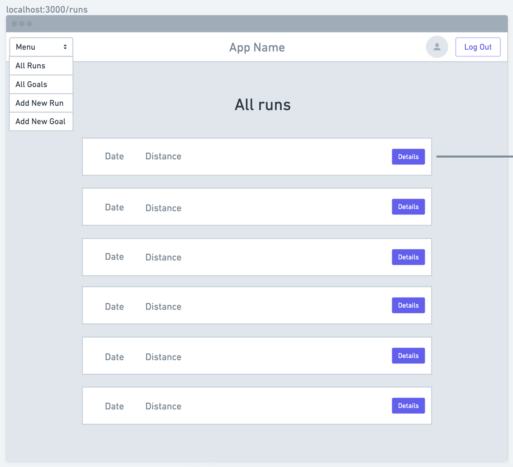
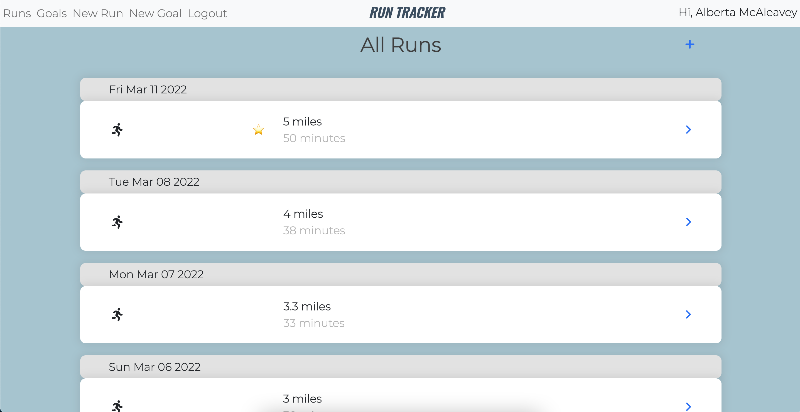

# Run Tracker
Run Tracker is a app for tracking your runs and related fitness goals. Users can log details about their runs, create new goals and accumulate achievements as they've been reached. 

## Motivation  
As a long time runner, I created Run Tracker as a way to visualize my progress and organize my training. Taking inspiration from running apps I've used in the past, I designed Run Tracker to be an individualized space each user, emphasizing the importance of comparing your progress only to your past self. 

## Getting Started
Click [here](https://run-tracker-am.herokuapp.com/) to view the app.  
Click [here](https://trello.com/b/21y9oWc3/run-tracker) to view the project planning materials.

Wireframe
  
Landing Page

## Technologies Used
  
 
  
  
  

## Next Steps
- [ ] profile page displaying stats such as total miles ran, achievements and most recent run details
- [ ] display completed goals at the bottom of the goals list
- [ ] display a logo
- [ ] have the ability to create goals from the all goals page
- [ ] add the ability to track additional workouts
- [ ] create a calendar view where users can view current and future planned workouts